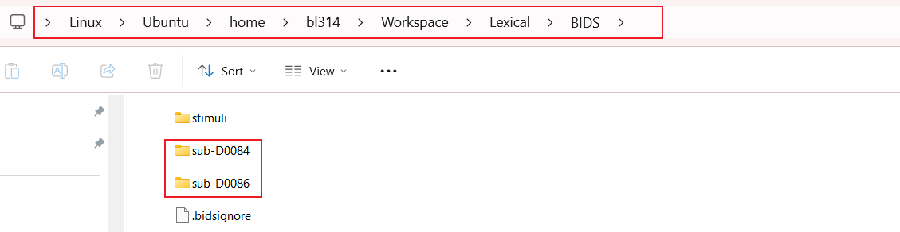
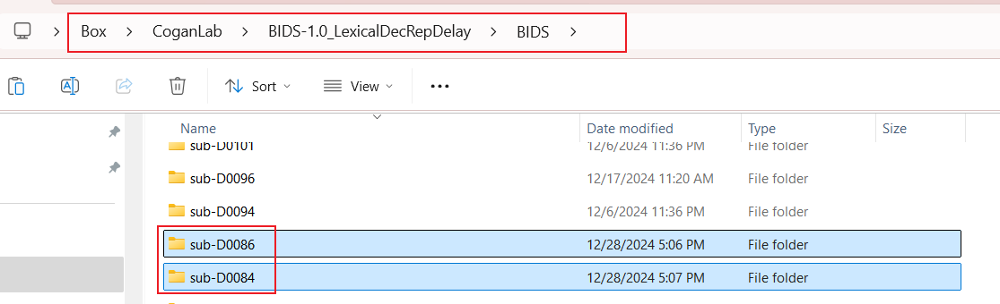
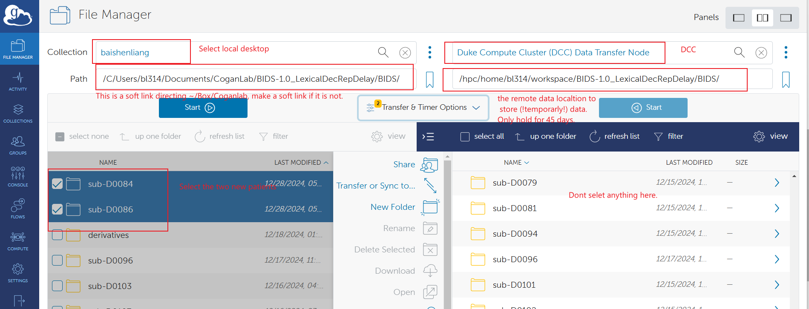
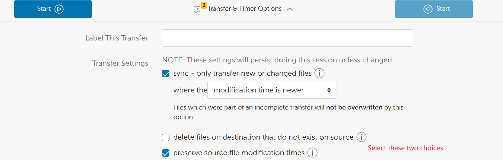
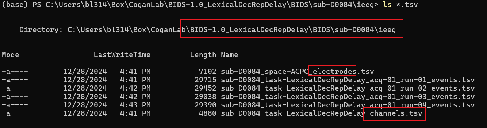
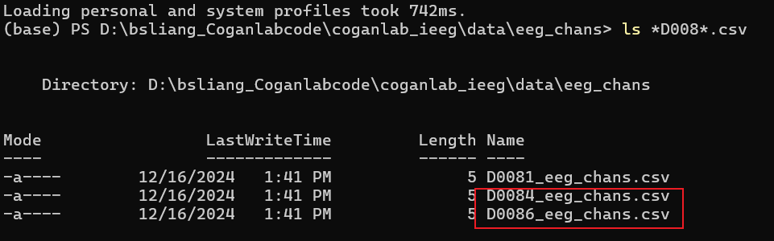

# IEEG processing scripts by Baishen Liang

Please clone the Cogan Lab ieeg repository (https://github.com/coganlab/IEEG_Pipelines) first, install ieeg, and use the ieeg environment as the interpreter.  

   

## Step0：response coding and BIDS convert  
See: [Gitlab response coding instructions](https://coganlab.pages.oit.duke.edu/wiki/docs/ECoG_In_Unit/Response_Coding/)  
(Duke NetID required)  
  
## Step1: files transfer and upload
**1.** Copy the BIDS coded EEG files:  
  
to Coganlab's box:  
   
  
**2.** Use **Globus** to synchronize the files:  
(Duke NetID required)  
  
and 
  
  
## Step2: update preprocessing batch codes for patients.  
**1.** Check whether the patient had eeg channels by inspecting these two files:  
  
Then write the report to this location:  
  
If there are eeg channels, add the `specific eeg channels` to the csv file.  
If there are no eeg channels, simply add a `nan`.  

**2.** Updated the `batch_preproc.py`.  
 
