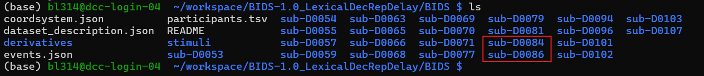

# IEEG processing scripts by Baishen Liang

Please clone the Cogan Lab ieeg repository (https://github.com/coganlab/IEEG_Pipelines) first, install ieeg, and use the ieeg environment as the interpreter.  

   

## Step 0：response coding and BIDS convert  
See: [Gitlab response coding instructions](https://coganlab.pages.oit.duke.edu/wiki/docs/ECoG_In_Unit/Response_Coding/)  
(Duke NetID required)  
  
## Step 1: files transfer and upload
**1.** Copy the BIDS coded EEG files:  
  
to Coganlab's box:  
  

**2.** Updated participants.tsv in:  
`~\Box\CoganLab\BIDS-1.0_LexicalDecRepDelay\BIDS`  
````text
# Add the new participants lines:  
sub-D0084	n/a	n/a	n/a	n/a	n/a
sub-D0086	n/a	n/a	n/a	n/a	n/a
````
  
**2.** Use **Globus** to synchronize the files to the Duke Computing Cluster (DCC):  
(Duke NetID required)  
  
and also the **participants.tsv**!!  
and  
  
  
## Step 2: update preprocessing batch codes for patients.  
**1.** Check whether the patient had eeg channels by inspecting these two files:  
  
Then write the report to this location:  
  
If there are eeg channels, add the `specific eeg channels` to the csv file.  
If there are no eeg channels, simply add a `nan`.  

**2.** Updated the `batch_preproc.py`.  
 

**3.** Adjust the sbatch parameters (e.g., to cover the range of patients).  
 

**4.** Commit and push. 
````bash
# cd to the local repository
git status
git add .
git commit -m "Patient D84 D86 added"
git push origin main
````

**5.** connect to the DCC.  
````bash
# use a new windows powershell window
ssh bl314@dcc-login.oit.duke.edu
# Input password and 2FA code
````

**6.** pull the repository.
````bash
# use the same powershell window as the DCC login
cd ~/bsliang_ieeg
# this is the soft link to:
# /hpc/group/coganlab/bl314/codes/bsliang_ieeg, where the github repository is cloned
git status
git pull
````
## Step 3: Run the batch script.
````bash
# still the powershell window as the DCC login
# see whether the patients' BIDS data have been uploaded
cd ~/workspace/BIDS-1.0_LexicalDecRepDelay/BIDS
ls
````
  
** Run the batch script for line noise filtering, outlier channels removal, and wavelet.  
````bash
cd ~/bsliang_ieeg/
sbatch sbatch_preproc.sh
````
You can `squeue -u bl314` to get the current status.  
  
 
Or you can check the script logs for python outputs or errors.  
````bash
# Check the sbatch output
cd ~/bsliang_ieeg/data/DCCbatchout/
cat slurm_84.err #errors
cat test84.out

# Check the python script output
cd cd ~/bsliang_ieeg/data/logs/batch_preproc_YYYY_MM_DD #change to the processing day
cat D0084.txt
````
## Tricks
Instead of using powershell, you can also use vscode or Duke's webpage to connect to the DCC.  
[DCC ondemand](https://dcc-ondemand-01.oit.duke.edu/pun/sys/dashboard/)  

## Step 4: Transfer files back to local desktop (Box).
**1.** Use Globus again to save files.  
  
Save **derivative** files to  
`~\Box\CoganLab\BIDS-1.0_LexicalDecRepDelay\BIDS\derivatives\clean`  

  
  
Save **figures** to  
`~\Box\CoganLab\D_Data\LexicalDecRepDelay\Baishen_Figs` 

  

## Step 5: Muscle artifact electrodes removal.  
**1.** Open the wavelet figure files in Box.    
````bash
# windows powershell
cd ~\Box\CoganLab\D_Data\LexicalDecRepDelay\Baishen_Figs\D0084\wavelet
explorer .
````
**2.** Also use this to plot patient's brain.  
````python
import mne
from ieeg.viz.mri import plot_subj
fig1 = plot_subj('D84')
mne.viz.set_3d_view(fig1, azimuth=150, elevation=70, focalpoint="auto",
                    distance="auto")
````
<div style="border: 2px solid #555; padding: 10px; background-color: #f9f9f9;">
  <strong>Electrodes may be considered as muscle electrodes if</strong><br>
  <em>(The combination of the following features should be chosen based on the actual situation.)</em>
  <ol>
    <li>Have very high frequency (e.g., &gt; 300 Hz) activations in oral response phase.</li>
    <li>Located in anterior temporal (shank crossing the jaw).</li>
    <li>For temporal electrodes, have strong motor activities but no auditory activities.</li>
    <li>At the beginnings or the endings of a shank (maybe outside the cortex).</li>
    <li>Sudden and strong activities (real neural activities are usually persistent).</li>
    <li>Very large low frequency activities that extend to high gamma band.</li>
  </ol>
</div>

**3.** Save manual artifact electrodes removal results  
 
Save it as a csv file with one electrode one row.  

## Step 5: Multitaper  
**1.** Update `batch_preproc.py`  
 

**2.** Commit, push, connect to DCC, and pull the repository to DCC as in `Step 1`.   

**3.**  Run the batch script again
````bash
# DCC
cd ~/bsliang_ieeg/
sbatch sbatch_preproc.sh
````
**4.**  Use Globus to synchronize the `~\Box\CoganLab\D_Data\LexicalDecRepDelay\Baishen_Fig` again to local `~\Box\CoganLab\D_Data\LexicalDecRepDelay\Baishen_Figs`.  

**5.**  Visually scan the multitaper results in `Baishen_Figs` (e.g., `Baishen_Figs\D0086\multitaper_4cons`). Re-do muscle artifact electrodes removal if needed.  


